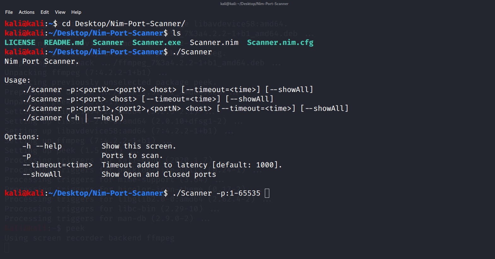

# NimScan
Multi-threaded asynchronous port scanner (With filtered option - Windows support only)

## Benchmarks


## Usage
```shell
Usage:
    nimscan.exe -p:<portX>-<portY> <host> [--timeout:<time>] [-f:<limit of file descriptors>] [-t:<number of threads>] [-a]
    nimscan.exe -p:<port> <host>
    nimscan.exe -p:<port1>,<port2>,<portN> <host>
Options:
    -h, --help            Show this screen.
    -p, --ports           Ports to scan. [default: 1-65,535]
    -a, --all             Use rawsockets to find filtered/closed/open ports (Takes longer and limited to 10,000 ports).       
    -t, --threads         Number of threads per scan. (Not supported on Linux)
    -f, --files           File descriptors per thread limit.
    --timeout             Timeout to add to the latency [default: 1500].
    
```
## Examples
Scan range between 1 to 5000 ports

```shell
nimscan.exe -p:1-5000 10.0.0.69
```

Scan specific ports
```shell
nimscan.exe -p:80,443,445 10.0.0.69
```

Show closed/filtered/open using rawsockets
```shell
nimscan.exe 10.0.0.69 -a
```
